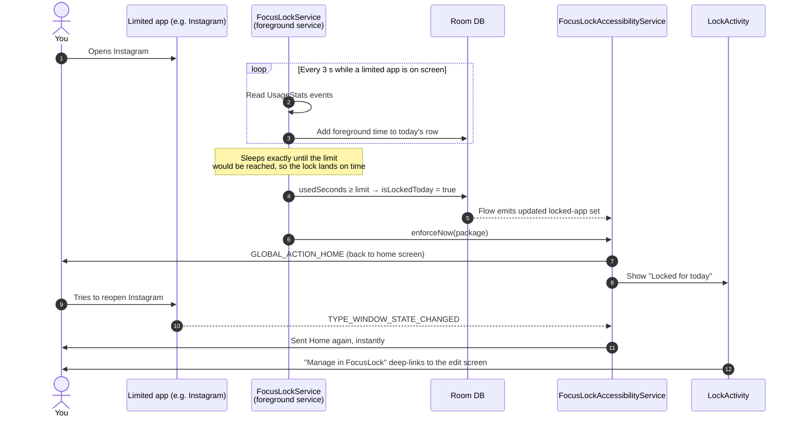
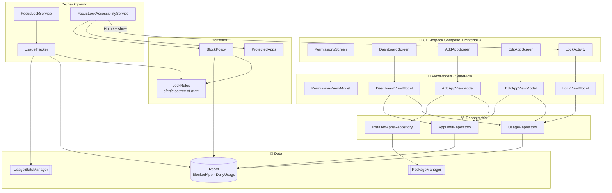
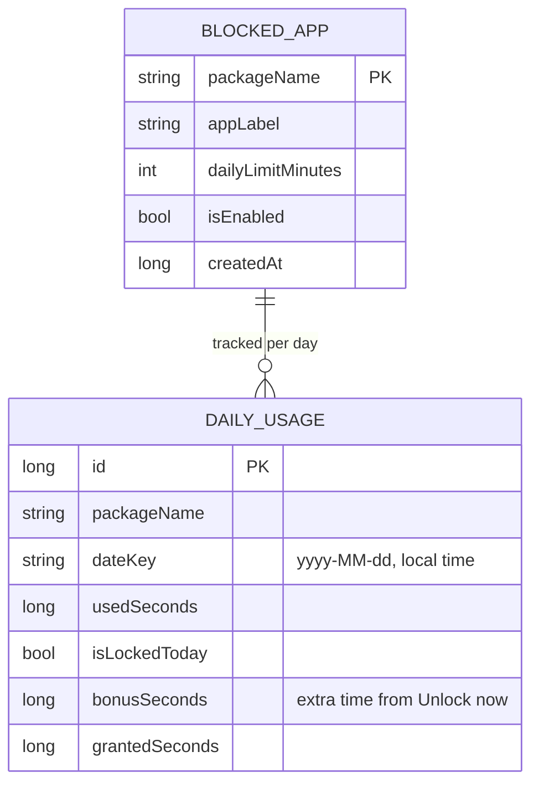

<div align="center">


<a href="#-getting-started">
  
</a>

<br/>


<br/>


<br/>



</div>


## 📖 About

**FocusLock** is a native Android app blocker that limits how long you can use *other* apps each day.

Give Instagram **10 minutes a day**. FocusLock quietly measures how long Instagram is on screen. The second you cross 10 minutes, Instagram is **covered by a full-screen lock page and you're sent to the home screen**. Open it again and you're bounced right back out, until midnight, when a fresh day starts.

It works with **any app you choose** from your installed apps, and FocusLock never locks itself. If there's an emergency, you can always open it and unlock an app for a few extra minutes.

> [!NOTE]
> Android does not let one app kill another. FocusLock blocks the same way established blockers (StayFree, AppBlock) do: it detects the foreground app, presses **Home** through an Accessibility Service and shows a lock screen on top.


## ✨ Features

<table>
<tr>
<td width="50%" valign="top">

### ⏱️ Per-app daily limits
Pick any launchable app, set a limit from **1 to 240 minutes** with a slider (5-min steps) or type an exact number.

### 📊 Live dashboard
Every rule is a card with the app icon, a **used vs. limit** progress indicator, time remaining and today's status (**Locked** or **Paused**).

### 🔒 Locked until midnight
Hit the limit and the app is locked for the rest of the day. Reopening it gets you sent Home again **instantly**.

### 🆘 Emergency "Unlock now"
Need it right now? Grant **+5 / 15 / 30 / 60 minutes** for today only. The math accounts for any overshoot, so the app doesn't re-lock the moment you unlock it.

</td>
<td width="50%" valign="top">

### ⏸️ Pause without deleting
Turn a rule off for a while and turn it back on later. A paused rule never locks.

### ↩️ Safe delete with undo
Remove a rule with a confirm dialog **plus** an undo snackbar. Undo restores today's usage too, so delete-and-undo can't be used to reset the counter.

### 🛡️ Can't lock yourself out
FocusLock itself and **every home-screen launcher** are protected and can never be blocked.

### ✅ Honest permissions checklist
A clear onboarding screen shows each required permission as granted or missing, with a one-tap button to the right Settings page.

</td>
</tr>
</table>


## ⚙️ How blocking works



**Two cooperating services:**

| | `FocusLockService` | `FocusLockAccessibilityService` |
|---|---|---|
| **Job** | *Measures* time | *Enforces* the lock |
| **How** | Reads `UsageStatsManager` events (exact timestamps, so nothing is lost between polls) | Listens for `TYPE_WINDOW_STATE_CHANGED` and checks an in-memory map of locked apps, with no DB hit per event |
| **Battery** | Adaptive cadence: **3 s** while a limited app is visible, **5 s** idle, **60 s** with the screen off; wakes instantly on screen-on | Event-driven, never reads screen content (`canRetrieveWindowContent` is off) |

If Accessibility is turned off, the tracker falls back to covering the app with the lock screen, and the dashboard explains that full blocking needs the permission.


## 🏗️ Architecture

Single-activity **MVVM** app with a repository layer, wired together by **Hilt**.



<details>
<summary><b>📂 Project structure</b> (click to expand)</summary>

```text
app/src/main/java/com/focuslock/app/
├── FocusLockApp.kt                  # @HiltAndroidApp
├── MainActivity.kt                  # single activity, handles focuslock://edit deep links
├── data/
│   ├── block/        BlockPolicy, ProtectedApps
│   ├── db/           AppDatabase, BlockedApp, DailyUsage + DAOs
│   ├── permissions/  PermissionChecker, SettingsIntents
│   ├── repository/   AppLimitRepository, UsageRepository, InstalledAppsRepository, DailyLimit, RemovedRule
│   └── usage/        UsageTracker, UsageEventsReader, ForegroundTimeAccumulator, LockRules
├── di/               DatabaseModule
├── service/          FocusLockService, FocusLockAccessibilityService, LockLauncher, LockNotifier
└── ui/
    ├── add/          search & pick an installed app, set its limit
    ├── dashboard/    live cards with progress & status
    ├── edit/         change limit · pause · unlock now · remove
    ├── lock/         the "Locked for today" screen
    ├── permissions/  onboarding checklist
    ├── common/ icons/ nav/ theme/
app/schemas/          Room schema exports (v1 → v3)
app/src/test/         JVM unit tests for LockRules and ForegroundTimeAccumulator
```

</details>


## 🗄️ Data model



Usage is stored **per calendar day** (unique on `packageName + dateKey`). A new day automatically means a new, empty row, so limits reset at local midnight even if the phone was switched off at the time.


## 🧰 Tech stack

<div align="center">

| Layer | Choice | Version |
|:--|:--|:--:|
| Language | Kotlin | `2.2.21` |
| UI | Jetpack Compose · Material 3 | BOM `2025.06.01` |
| Build | Gradle · Android Gradle Plugin | `8.13` · `8.13.2` |
| JDK | OpenJDK / JetBrains Runtime | `17` |
| SDK | compile / target · min | `36` · `26` |
| DI | Hilt (+ KSP) | `2.57.2` |
| Database | Room | `2.7.2` |
| Async | Coroutines + Flow | `1.10.2` |
| Preferences | DataStore | `1.1.7` |
| Background | WorkManager | `2.10.2` |
| Navigation | Navigation-Compose | `2.9.1` |
| App icons | Coil 3 | `3.2.0` |

</div>


## 🔐 Permissions & why each one is needed

| Permission | How it's granted | Why |
|---|---|---|
| 📈 **Usage access** `PACKAGE_USAGE_STATS` | Settings → *Usage access* | Measure how long each limited app is in the foreground |
| 🪟 **Display over other apps** `SYSTEM_ALERT_WINDOW` | Settings → *Display over other apps* | Lets the lock screen start from the background, on top of a blocked app |
| ♿ **Accessibility service** | Settings → *Accessibility* → FocusLock | Instantly detect which app came to the front and press **Home** |
| 🔔 **Notifications** `POST_NOTIFICATIONS` | Runtime dialog (Android 13+) | Persistent tracking notification and "App locked" notices |
| 🛰️ **Foreground service** `FOREGROUND_SERVICE(_SPECIAL_USE)` | Automatic | Keeps tracking alive in the background (Android 14+ special-use type) |

> [!IMPORTANT]
> **There is no `INTERNET` permission.** FocusLock is local-only by design: no backend, no analytics, no tracking. Installed apps are discovered through a `<queries>` element (launcher + home intents) instead of the broad `QUERY_ALL_PACKAGES`.


## 🚀 Getting started

### Prerequisites

- **Android Studio** (latest stable)
- **JDK 17** (the JetBrains Runtime bundled with Android Studio works)
- **Android SDK 36**
- An Android phone running **8.0+** with **Developer options → USB debugging** turned on

### Build & install

```bash
# 1. Clone
git clone https://github.com/shreyashk07004/Focus-Lock.git
cd Focus-Lock

# 2a. Install straight onto a USB-connected phone
./gradlew installDebug

# 2b. …or build an APK to sideload
./gradlew assembleDebug
#     → app/build/outputs/apk/debug/app-debug.apk
```

> On Windows use `gradlew.bat` instead of `./gradlew`. You can also just open the folder in Android Studio and press ▶️ **Run**.

<details>
<summary><b>📱 First launch: granting the special permissions</b> (click to expand)</summary>

<br/>

FocusLock opens on a **permissions checklist**. Each row is 🟢 granted or 🔴 missing, with a button that jumps to the right Settings page.

1. **Usage access**: find *FocusLock* in the list and switch it on.
2. **Display over other apps**: allow FocusLock.
3. **Accessibility**: open *Installed apps / Downloaded services* → *FocusLock* → turn it on and confirm.
   - On **Android 13+** sideloaded apps may show *"Restricted setting"*. Open **Settings → Apps → FocusLock → ⋮ → Allow restricted settings**, then try again.
4. **Notifications**: allow when prompted.

Return to FocusLock. Once everything is green, tap **+ Add app**, pick an app, set a limit and you're done. 🎉

</details>

<details>
<summary><b>🧪 Real device vs. emulator</b></summary>

<br/>

| Works on an emulator | Needs a real phone |
|---|---|
| Adding, editing, pausing and removing rules | Accurate usage tracking over real app sessions |
| Dashboard, navigation and theming | Accessibility-based blocking (Home + lock screen) |
| Unit tests | Battery, screen-off and OEM background-kill behavior |

Emulators can grant the permissions, but blocking only feels right on real hardware where you actually use the limited apps.

</details>


## 🧪 Tests

The critical logic lives in plain Kotlin so it can be tested on the JVM:

- **`LockRulesTest`**: when an app counts as locked, effective limits with bonus time, "Unlock now" overshoot math
- **`ForegroundTimeAccumulatorTest`**: turning raw usage events into accurate foreground time

```bash
./gradlew testDebugUnitTest
```


## 🗺️ Roadmap

- [x] Room data model + installed-app picker with icons
- [x] Dashboard, add / edit / pause / delete with undo
- [x] Permissions onboarding checklist
- [x] Foreground-service usage tracking with adaptive polling
- [x] Accessibility blocking + "Locked for today" screen
- [x] Per-day reset via date-keyed usage rows
- [x] Emergency "Unlock now" with bonus minutes
- [ ] Restart tracking automatically after reboot (boot receiver)
- [ ] Settings screen: reset hour, strict mode, theme picker
- [ ] Weekly usage history & insights


## 🤝 Contributing

Issues and pull requests are welcome. Please keep the project's core promises:

1. **Local only**: no network calls, no analytics.
2. **Battery-friendly**: event-driven detection, no tight polling loops.
3. **Honest permissions**: explain every grant, never trick the user.

<div align="center">

<br/>

Made with 💜 and Kotlin by [**@shreyashk07004**](https://github.com/shreyashk07004)

⭐ If FocusLock helps you focus, consider giving it a star!


</div>
